# Bootcamp da DIO Binance - Blockchain Developer with Solidity
## Criando um NFT
#### Criando o NFT no OpenSea

##### Configurando Carteira no MetaMask
- Utilizando os dados passados no Desafio
~~~
MetaMask

stone cluster duck whip idle moment capital jazz camera fringe planet solar

0xA9155F5B6FC993A82346a8ff86EFEf513fc4c096
~~~

- adicionando extensão no chrome
- importando a carteira 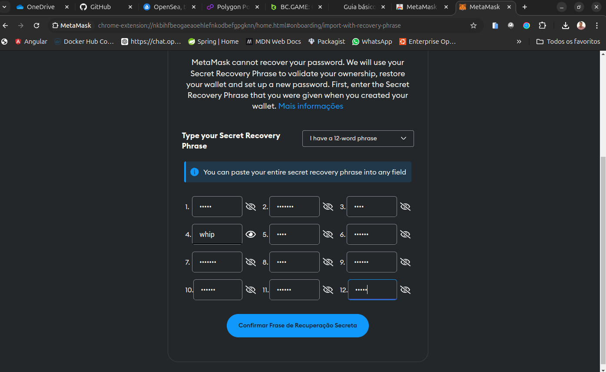
- carteira importada 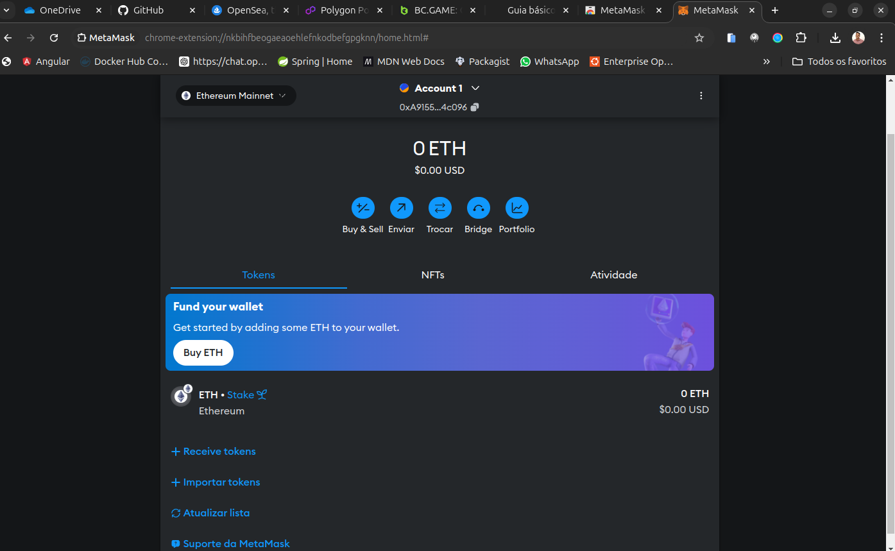 sem saldo algum
- entrando no site [opensea.io] 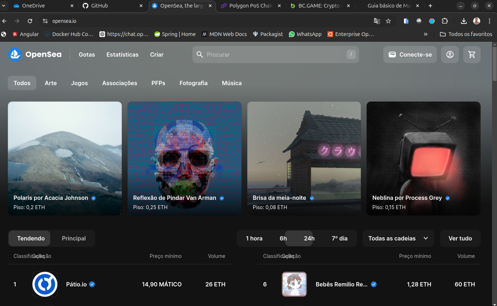
- conectando carteira 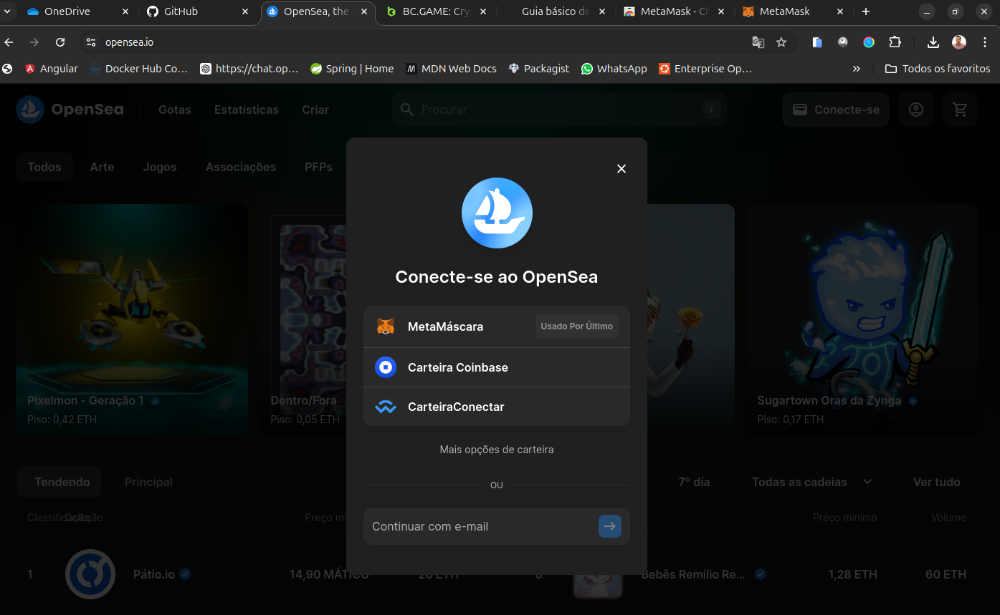
- confirmando conexão de carteira 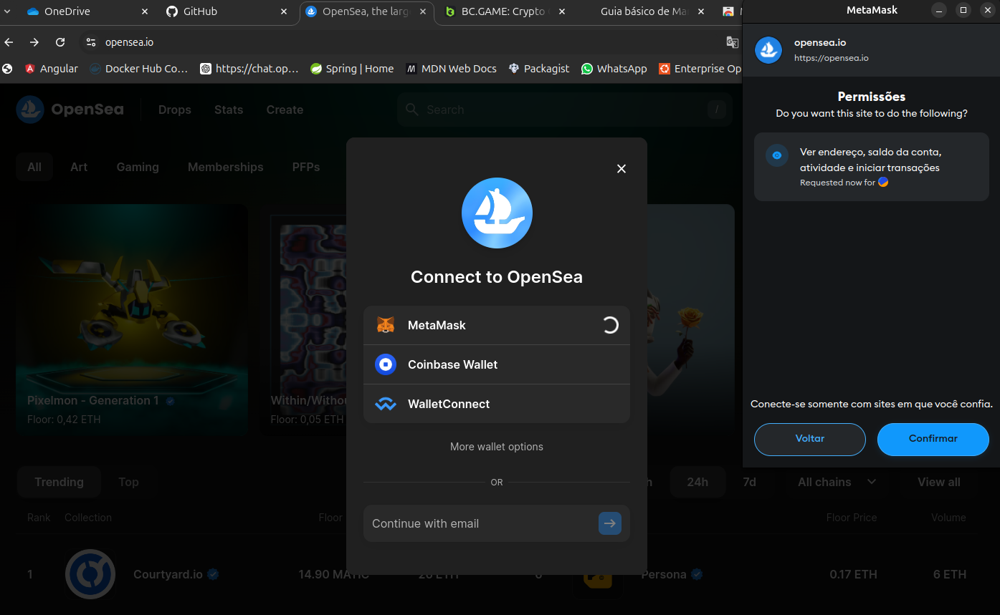
- carteira conectada 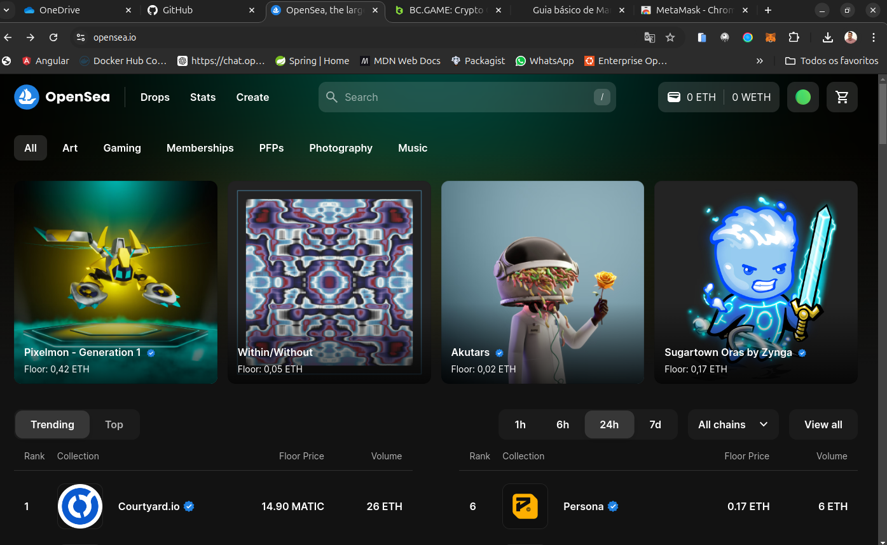
- criando o primeiro NFT - primeira parte 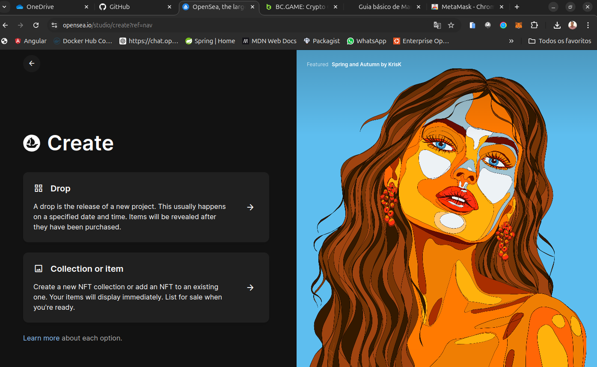
- segunda parte da criação 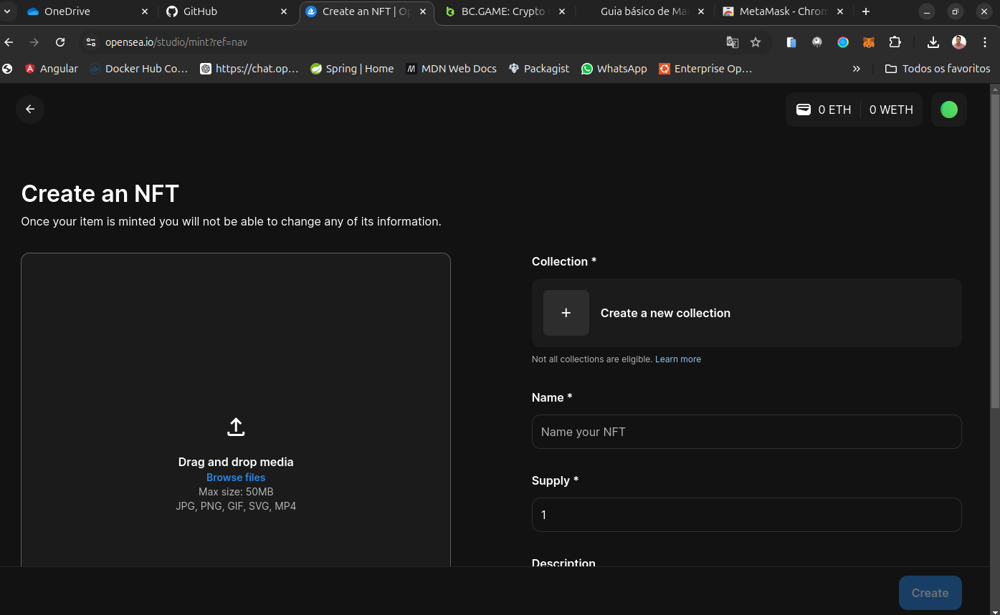
- inserido dados e imagens - terceira parte 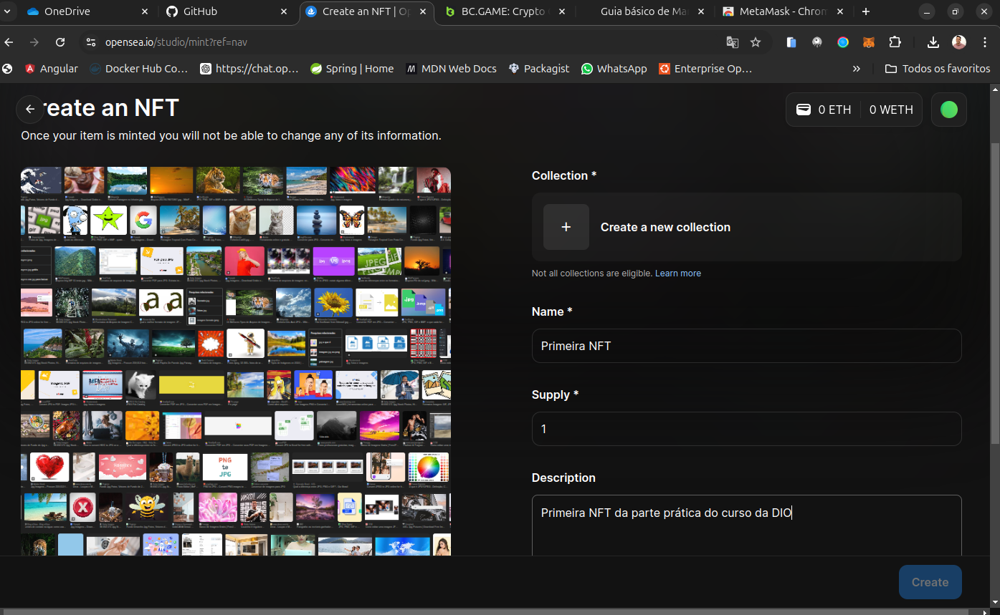
- continuação da tela e o item create não fica ativo 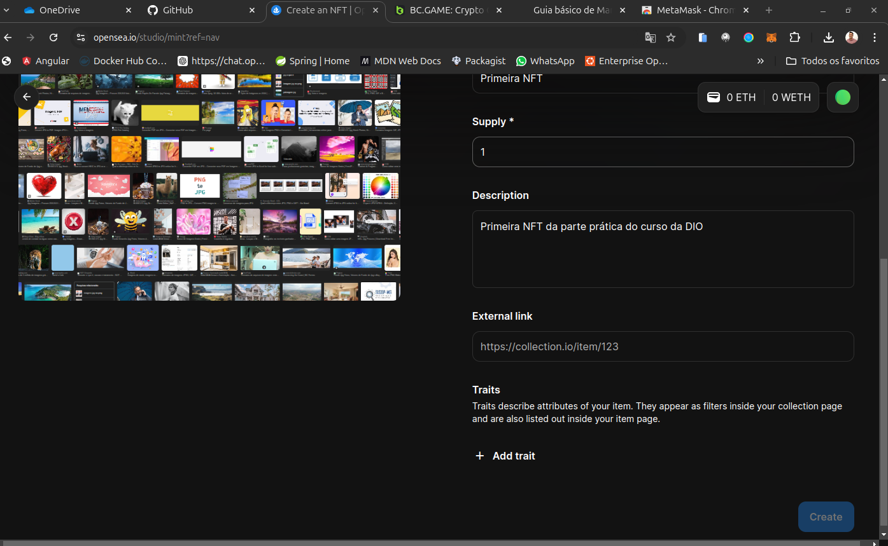
- se retorno para cima e clico no botão **Create-a-new-collection**, tenho a seguinte tela 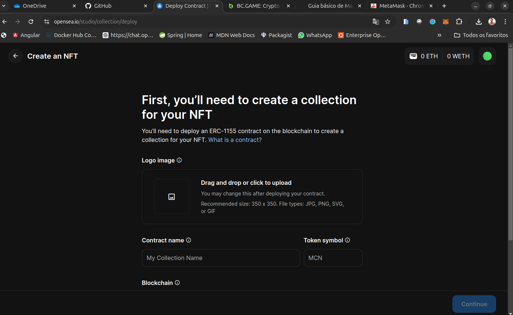
- subo novamente a imagem, tenho que criar um Contract e pela rede Polygon preciso pagar US$0,01 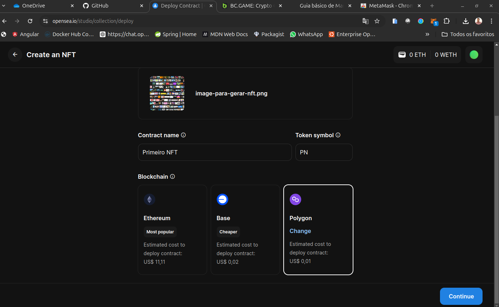, porém não foi isso que foi mostrado no vídeo de criação de NFT. POis atualmente eu sou obrigado para criar um NFT criar uma Collection.

- A criação de NFT pela Uptick, foi realizada porém sem sucesso também, pois na carteira passada não tinha fundos para criação. Criei a minha carteira porém sem sucesso também, assim ficou o aprendizado não concluído com sucesso. 
Acredito que o curso foi gravado no ano de 2022 e já estamos em 2024 e muitos processos foram modificados. Assim fica a minha experiência e o pedido de atualizar essa parte de craição de NFT na OpenSea com o contrato.# craincao-de-NFT
